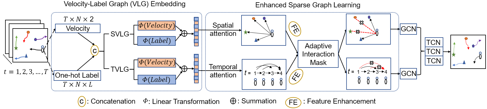

[](https://github.com/Carrotsniper/Multiclass-SGCN/blob/main/LICENSE)
## Multiclass-SGCN: Sparse Graph-based Trajectory Prediction with Agent Class Embedding

This is the official implementation of our paper **Multiclass-SGCN**.

This work has been accepted at the International Conference on Image Processing (ICIP 2022). The conference paper is available here.



## Abstract
Trajectory prediction of road users in real-world scenarios is challenging because their movement patterns are stochastic and complex. Previous pedestrian-oriented works have been successful in modelling the complex interactions among pedestrians, but fail in predicting trajectories when other types of road users are involved (*e.g., cars, cyclists, etc.*), because they ignore user types. Although a few recent works construct densely connected graphs with user label information, they suffer from superfluous spatial interactions and temporal dependencies. To address these issues, we propose **Multiclass-SGCN**, a sparse graph convolution network based approach for multi-class trajectory prediction that takes into consideration velocity and agent label information and uses a novel interaction mask to adaptively decide the spatial and temporal connections of agents based on their interaction scores. The proposed approach significantly outperformed state-of-the-art approaches on the Stanford Drone Dataset ([SDD](https://cvgl.stanford.edu/projects/uav_data/))
, providing more realistic and plausible trajectory predictions.

## Models

All the experiments are done with Stanford Drone Dataset (SDD), we compare our proposed work with 8 models.
Method | mADE | mFDE
:---:|:---:|:---:
Linear            | 37.11 | 63.51 
[SF](https://ieeexplore.ieee.org/stamp/stamp.jsp?tp=&arnumber=5995468)                | 36.48 | 58.14 
[Social-LSTM](https://ieeexplore.ieee.org/stamp/stamp.jsp?tp=&arnumber=7780479)       | 31.19 | 56.97 
[Social-GAN](https://arxiv.org/abs/1803.10892)        | 27.25 | 41.44
[CAR-Net](https://arxiv.org/abs/1711.10061)           | 25.72 | 51.80
[DESIRE](https://arxiv.org/abs/1704.04394)            | 19.25 | 34.05
[Social-STGCNN](https://openaccess.thecvf.com/content_CVPR_2020/papers/Mohamed_Social-STGCNN_A_Social_Spatio-Temporal_Graph_Convolutional_Neural_Network_for_Human_CVPR_2020_paper.pdf)     | 26.46 | 42.71
[Semantics-STGCNN](https://arxiv.org/abs/2108.04740)  | 18.12 | 29.70
**Multiclass-SGCN (ours)** | **14.36** | **25.99**

## Installation
The codebases are built on top of [Semantic-STGCNN](https://github.com/Yutasq/Multi-Class-Social-STGCNN) and [SGCN](https://github.com/shuaishiliu/SGCN) 

#### Requirements
- Linux or Windows with Python 3.9, with CUDA verion: 11.3
- PyTorch ≥ 1.5 and [torchvision](https://github.com/pytorch/vision/) that matches the PyTorch installation.
- ALl libraries: install from requirements.txt
  ```
  # For conda user
  conda create --name <env_name> --file requirements.txt
  
  # For pip user
  pip install -r requirements.txt

  ```
#### Steps
1. Download the codes:

```
https://github.com/Carrotsniper/Multiclass-SGCN.git
cd Multiclass-SGCN
```

2. To train the model run 
```
python train.py
```

3. To test the model run  
```
python test_pred.py
```

## Visualisations

